# VibeFinder 2.0 — Applied AI Music Recommender

## Base Project

This project extends **VibeFinder 1.0** (Module 3: Music Recommender Simulation). VibeFinder 1.0 was a content-based music recommender built in Python that scored every song in an 18-track catalog against a user's stated preferences and returned the top 5 matches with plain-English explanations. It used seven weighted scoring rules and supported a diversity filter to prevent artist repetition.

---

## Project Summary

VibeFinder 2.0 extends the original recommender into a full applied AI system by adding a **Reliability and Evaluation layer**. The system automatically tests its own output across five user profiles, scores each result set with a structured confidence metric, detects failure modes using guardrails, and prints a pass/fail summary report.

---

## Architecture Overview



- **Input** — user profile and 18-song catalog from data/songs.csv
- **Recommender** — original VibeFinder 1.0 scorer, returns top 5 songs
- **Evaluator** (src/evaluator.py) — confidence score 0.0-1.0 + guardrail detection
- **Test Harness** (tests/test_harness.py) — runs all 5 profiles, prints pass/fail summary

---

## Setup Instructions

1. Clone the repository:
```bash
   git clone https://github.com/armirchandani/applied-ai-system-project.git
   cd applied-ai-system-project
```

2. Install dependencies:
```bash
   pip3 install -r requirements.txt
```

3. Run the original recommender:
```bash
   python3 -m src.main
```

4. Run the reliability test harness:
```bash
   PYTHONPATH=src python3 tests/test_harness.py
```

---

## Sample Interactions

### Example 1 — Happy Pop Fan (PASS, confidence 1.00)
Profile: genre=pop, mood=happy, energy=0.8
Top result: Sunrise City, score=5.45
Confidence: 1.00 | Guardrails: none

### Example 2 — Conflicted Listener (FAIL, confidence 0.55)
Profile: genre=jazz, mood=happy, energy=0.9
Top result: Smoky Quarter, score=3.90
Confidence: 0.55 | Guardrails: energy_drift

### Example 3 — Genre Ghost (FAIL, confidence 0.53)
Profile: genre=country, mood=focused, energy=0.5
Top result: Focus Flow, score=2.06
Confidence: 0.53 | Guardrails: genre_gap

---

## Test Harness Summary

- 3/5 profiles passed | Avg confidence: 0.82
- PASS: Happy Pop Fan (1.00), Chill Lofi (1.00), Intense Rock (1.00)
- FAIL: Conflicted Listener (0.55, energy_drift), Genre Ghost (0.53, genre_gap)
- All profiles deterministic across 3 runs

---

## Design Decisions

Why a reliability system? The original VibeFinder 1.0 had documented failure modes. A reliability system makes those failures visible and measurable rather than anecdotal.

Why rule-based confidence scoring? A rule-based evaluator is fully transparent — every point traces back to a specific inspectable condition.

Trade-offs: The confidence rubric inherits the recommender's genre bias. The pass threshold of 0.65 was chosen to match known behavior.

---

## Testing Summary

3 out of 5 profiles passed with confidence >= 0.65. Average confidence: 0.82. The two failures matched exactly the failure modes documented in VibeFinder 1.0. All profiles were fully deterministic across 3 runs.

---

## Reflection

Extending VibeFinder into a reliability system made earlier design choices feel more consequential. The confidence scores gave precise language for something previously qualitative. Building the test harness forced honest confrontation with cases where the recommender genuinely does not work.

---

## Limitations and Risks

- 18-song catalog is too small for meaningful genre-based scoring
- Confidence rubric shares the recommender's genre bias
- No context awareness — same results regardless of time or activity
- Silent failures remain in base recommender; evaluator detects but does not fix them

See model_card.md for full analysis.

---

## Video Walkthrough

[Loom walkthrough link — add before submission]

---

## Repository Structure

